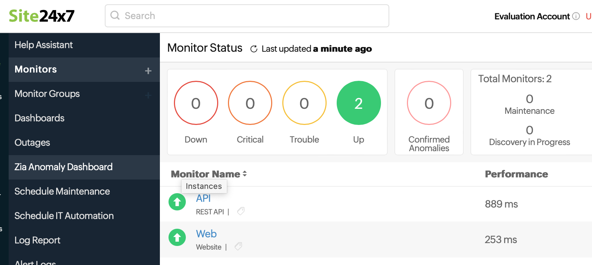
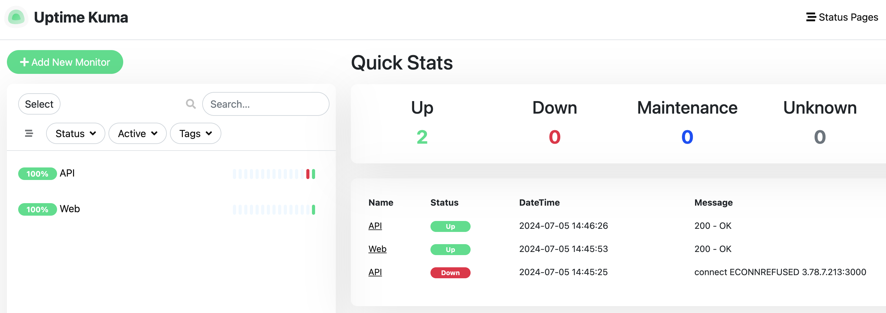

# test-task-redvike

## General

This is a test task for DevOps position.

It was required to set up simple CI/CD pipeline that will clone NestJS repository, build it and deploy to some free tier AWS EC2 instance.

Currently the code is built and deployed to the host as a Docker image.

Endpoint is accessible on 3000 port:

- http://qa.slaviktech.com:3000
- 3.78.7.213:3000

If you hit the endpoint it will give you "Hello World!".

Also, there is a debug welcome webpage that is served by Nginx and used for testing purposes. Nginx can be used as a reverse proxy solution to host HTTPS traffic and balance the load between different Docker containers behind.

Welcome page:

- http://qa.slaviktech.com
- 3.78.7.213

## Infrastructure

Obviously we need to have some instance where we will deploy our code and that code will be available for our clients.  
Folder _terraform_ contains simple setup of EC2 instance, VPC, security groups and DNS record.

There are two branches:

- main
- infrastructure-without-dns

Main branch is for my needs that creates DNS record and deployed code can be accessible by URL _qa.slaviktech.com_
If you want to recreate the same infrastructure but without DNS you should use the second branch _infrastructure-without-dns_

Use _tf plan_ and _tf apply_ to create infrastructure

## CI/CD

All pipeline is described in _.github/workflows/deployment.yml_ file
There are two jobs in Github Actions:

- build
- deploy

_Build job_ checkouts the code, clones NestJS starter repo, sets up Docker Buildx, logs in to Docker hub, created Docker image via multistage build and pushes result image to Docker Hub.

_Deploy job_ logs in to EC2 instance via SSH, pulls the image and runs the Docker container.

## Monitoring

EC2 host is created with the detailed monitoring, so we can track all hardware metrics in AWS console.

But we need also to track availability of our services from the outside.
I used two services, where I set up two monitoring agents.  
One agent pings our API on 3000 port, another agent monitors webpage.

For test task monitoring can be pretty simple. I used one website and another selfhosted tool.

First monitoring service is 3rd party service. You can see dashboard on the screenshot:  

https://www.site24x7.eu/app/client#/home/monitors

Also, for my pet projects I use Uptime Kuma. It can be deployed in the Docker container. You can run that service  with the following command:
`docker run -d --restart=always -p 3001:3001 -v uptime-kuma:/app/data --name uptime-kuma louislam/uptime-kuma:1`
Dashboard:  

## Needed secrets for running the repo

It's needed to create Access key for IAM use in AWS to work with Terraform. The full manual can be found [here](https://docs.aws.amazon.com/IAM/latest/UserGuide/id_credentials_access-keys.html).  

If you use macOS, you need to put the key to special file that is located at _~/.aws/credentials_:  
`
[terraform]  
aws_access_key_id = yourkeyid  
aws_secret_access_key = yourkey
`

Also, you need to create account for Docker Hub.

For SSH connection it's needed to create SSH key and add it to your AWS account. You can find the manual [here](https://docs.aws.amazon.com/AWSEC2/latest/UserGuide/create-key-pairs.html).
Then you need to specify the name of your key in _variable "ssh_keyname"_ in the  _terraform/variables.tf_ file.

After you create infrastructure you need to get the IP address of your host. It will be given by the Terraform output _elastic_ip_.

After all credentials are collected you need to add them to Github Actions secrets:

- DOCKER_USERNAME
- DOCKER_PASSWORD
- TARGET_HOST
- SSH_USERNAME
- SSH_KEY

## COMMENTS

This is not the ideal setup, it's not ideal and not very production ready, there are a lot of things needed to add.

1. SSH access is allowed from every IP. It is done due to simplification, Github runners have a wide range of IP addresses, it was a document with 4000+ entries, so it's not comfortable to limit them via EC2 security groups. As alternatives we can use dedicated builders or use Bastion host to have access inside the infrastructure.
2. Currently we provision the host with user-data bash script. It installs HHTP server and Docker, does some system administration. IDK but Terraform have some bugs on my laptop these days and don't execute user0data script properly sometimes. Alternatively we can use Ansible as executor and configuration tool. Also, we can create OS image with Packer that contains all needed tools installed.
3. Maybe it's more robust thing to unite Github Actions and AWS CodeDeploy, but the setup is pretty complex.
4. I played with Docker Compose for future development and we can execute Docker Compose on remote host, but if we are talking about remote execution for multple containers we need to move to more sophisticated orchestration tools like K8S.
5. There is some hardcode ergarding DNS and EC2 IP address, I didn't check how can we update Github secrets but I know how to update pipeline variables in GitLab, so it should be the same in Github.
6. Terraform code can be split to modules to have easier infrastructure provisioning and flexibility.
7. Seroius project has to use external security scanner.
8. I didn't implement different infrastructure stages like QA and PROD due to time limitaion, but it should be done in the future. And when we implement different stages we can create Aoolication Load Balancer that will rout our traffic and will be the one entry point to our network.
9. We can move TF code backend to AWS to use TF state for different team members.
10. I was playing with the certbot for hosting HTTPS traffic but I didn't have time to finish it up.

## DNS

Just if you are interested in, I have a Namecheap DNS, and it's needed to set up custom DNS on the Namecheap from AWS Route53 NS record DNS.
