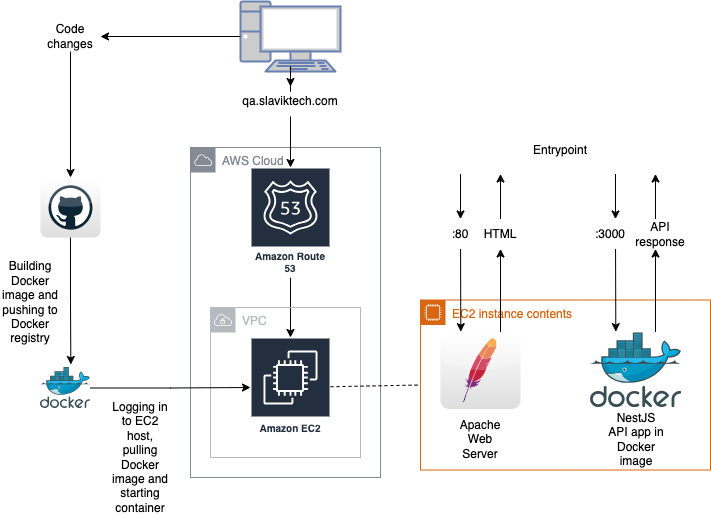
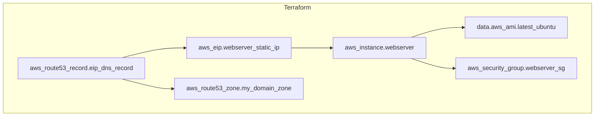
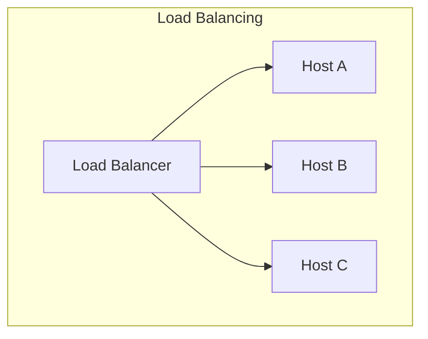

# Architectural Design

## Description

This document describes existing deployment for the test task. The Practical task requieres to implement CI/CD Pipeline that clones, builds and deploys simple NestJS project for backend. AWS is chosen as a Cloud services provider.

**Idea** title will highlight the part that can be used in Production.

This document is exported to PDF and can be found in the **docs** folder.

## System Diagram

Diagram is composed with Draw.io

## Cloud Infrastructure Diagram

Terraform Infrastructure Diagram is composed with Terramaid.

## Explanation to the diagram

### Rationale

Simple implementation is developed for the test task.  
Github is chosen for code storage and Github Actions for CI/CD.  
AWS instance with free tier is chosen because the task doesn't require high computational resources.  
Only one endpoint should be accessible from the Internet on the port 3000. So there is no load balancing ahead the host.  
Also, debug webpage is added to the host and is served on the port 80 by Apache web server. Currently there is no need for load balancing.

#### Idea

For production needs it's required to have load balancer in front of the hosts like on the next diagram.

Load balancing (LB) will help us to balance traffic between application hosts, avoid high pressure on the host, cut the cost on powerful servers. Also, LB can give several opportunities:

- LB helps with safe deployments by rerouting traffic and excluding the host that is upgrading.
- LB increases stability of the system. If one host is down, traffic can be routed between online hosts.
- LB can help with testing, environment separation and security access control.

LB can be implemented as a cloud service like Appplication Load Balancer (ALB) in AWS if our main requirement is to set up cloud infrastructure. BTW, AWS ALB uses Nginx under the hood. THis vendor solution gives us remote access by API and simlifies the setup but gives us less control for settings. As an alternative we can take a look at the self-hosted Nginx setup, but it requires more time for proper setup.

### Scalability and Security

Terraform (TF) was chosen to create the cloud infrastructure and follow IaC practice. Setup gives us opportunity to run infrastructure updates without downtime.  
If we want to add more development environments to separate PROD and TEST, we can copy the TF code or refactor it to module structure. It depends on our project structure and requirements.  
If we need to add more computational resources to the project the host type can be changed to more powerful.  
Access to services is controlled by Security Groups. Allowed access for 22, 80 and 3000 ports. SSH access on the 22nd port is needed for Github Actions acess. For security reasons it should be refactored.  
No SSL is implemented to simplify the project setup. Obviously it should be enabled for security reasons in the production use.  
One VPC (Virtual Private Cloud) was used.

#### Idea

For security enhancement it's needed to implement a bastion host in the VPC that will allow access inside the network from the outside. That host can be used for GitHUb Actions acceess or for redirecting some info inside and outside of the internal network.

We can use different VPCs to separate QA and PROD environments to isolate cloud resources and define subnets, route tables, and network gateways.  
Also, AWS has good instruments as Security Groups and IAM Roles to control inbound and outbound traffic to instances and manage permissions for AWS services and resources.

### Recovery and Availability

The implemented system doesn't have many components, so there are no any special requirements for disaster recovery.  However there are several DNS servers that serve the routing. And autoscaling group can be added to help to recreate the EC2 instance automatically if any troubles happen.  
Monitoring is setup for the project. Simple healthcheck is enabled for 80 and 3000 ports.

#### Idea

Detailed monitoring should be enabled in Amazon during creation the resource. It will help us to monitor ovarall system productivity and find problems. In addition, it can be used some 3rd party tool for monitoring like Grafana or some AWS cloud service.

### Cost Consideration

The only expenses in this setup are done to rent the domain name for one year. During one year EC2 host of t2.micro type can be served for free under the limited load.

#### Idea

Obviously if the project should increase computational resources to serve more clients the maintenance cost of the infrastructure will increase.

## Conclusion

This document was prepared for already done solution and describes details regarding implementation. It doesn't include detailed service choose between multiple alternatives with their description. Also, there is no detailed cost calculation because of the demo nature of implementation.  
System can be developed both ways, horizontally and vertically. Terraform code can be refactored infinitely :) Overall system design requires multiple hours of meetings, clarifications, discussions. The main thing to keep in head: the implementation should follow the business needs.