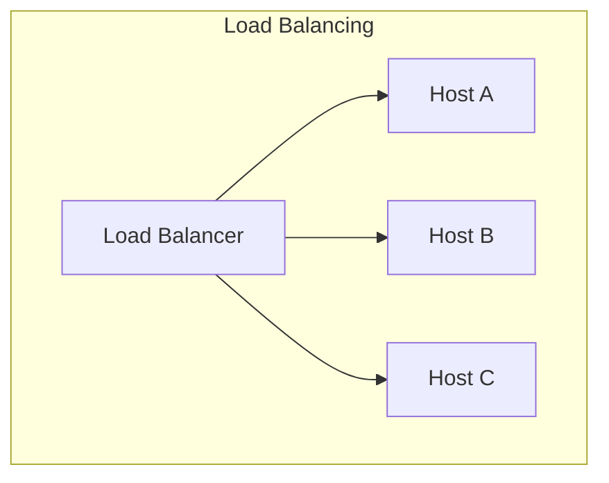

```mermaid
flowchart TD;
	subgraph Load Balancing
        load_balancer["Load Balancer"]
        host_a["Host A"]
        host_b["Host B"]
        host_c["Host C"]
        load_balancer --> host_a
        load_balancer --> host_b
        load_balancer --> host_c
	end
```
