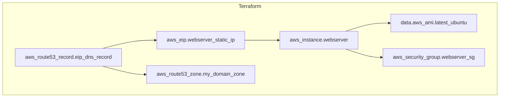

```mermaid
flowchart TD;
	subgraph Terraform
		data.aws_ami.latest_ubuntu["data.aws_ami.latest_ubuntu"]
		aws_eip.webserver_static_ip["aws_eip.webserver_static_ip"]
		aws_instance.webserver["aws_instance.webserver"]
		aws_route53_record.eip_dns_record["aws_route53_record.eip_dns_record"]
		aws_route53_zone.my_domain_zone["aws_route53_zone.my_domain_zone"]
		aws_security_group.webserver_sg["aws_security_group.webserver_sg"]
		aws_eip.webserver_static_ip --> aws_instance.webserver
		aws_instance.webserver --> data.aws_ami.latest_ubuntu
		aws_instance.webserver --> aws_security_group.webserver_sg
		aws_route53_record.eip_dns_record --> aws_eip.webserver_static_ip
		aws_route53_record.eip_dns_record --> aws_route53_zone.my_domain_zone
	end
```
